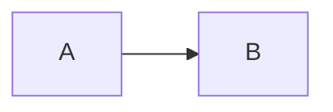
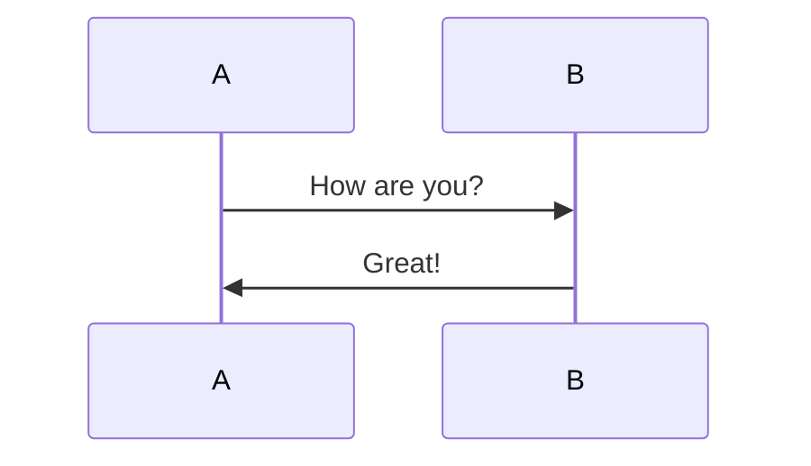
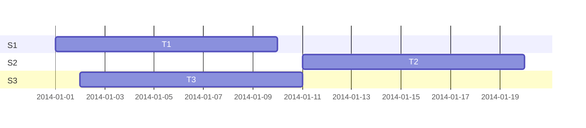

## markdown test

### code

```java
void run(){
  execute();
}
```

### math

```math
c = \pm\sqrt{a^2 + b^2} \\
E = mc^2 \\

x = {-b \pm \sqrt{b^2-4ac} \over 2a}

E = mc^2

evidence_{i}=\sum_{j}W_{ij}x_{j}+b_{i}

测试公式: \\ 
x = {-b \pm \sqrt{b^2-4ac} \over 2a}
x=\frac{-b\pm\sqrt{b^2-4ac}}{2a} 
```

### mermaid graph



### mermaid sequenceDiagram



### mermaid gantt



